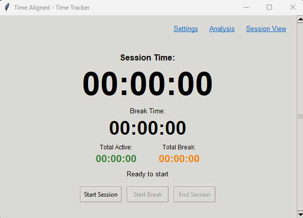

# Time Aligned - Time Tracker

    

A comprehensive time tracking desktop application built with Python — featuring session tracking, idle detection, Google Sheets integration, screenshot capture, and a full analysis suite.

| Home                                    | Active Session                                               |
| --------------------------------------- | ------------------------------------------------------------ |
|  |  |

## Features

### Core Tracking

- **Session Tracking**: Start, pause, and end work sessions
- **Editable History**: Edit past sessions — update sphere, project, action, and other fields at any time
- **Secondary Projects**: Tag any period (active, break, or idle) with a secondary project/action and a time percentage for more accurate tracking
- **Break Management**: Track breaks separately from active work time
- **Idle Detection**: Automatically detect when you're away from your computer — optional, with a configurable threshold; automatically starts a break after a customizable idle duration
- **Multiple Spheres & Projects**: Organize your work into categories and projects
- **Note Taking**: Add notes on both individual periods and overall sessions
- **Global Hotkeys**: Hide the window to the system tray and use hotkeys to start, take a break, or end a session — operate fully headless
- **Auto Backup**: Continuously saves to the data file during a session; creates a backup JSON file when deleting a session

### Customizable Settings

- Manage, archive, and set defaults for spheres, projects, and break actions — auto-populated in session and analysis frames
- Record goals for projects and notes for actions
- Configure idle detection thresholds
- Opt in for screenshot capture
- Connect to Google Sheets by extracting your spreadsheet ID and credentials for automatic upload
- Export all data to CSV for local storage

### Screenshot Capture

- Optional screenshot capture during sessions
- Captures on window focus changes and at configurable time intervals
- Helps you remember what you were working on

| Screenshot During Session                                                     | Captured Screenshot Folders                                           |
| ----------------------------------------------------------------------------- | --------------------------------------------------------------------- |
|  |  |

### Google Sheets Integration

- Automatically upload session data to Google Sheets
- All sessions append to the same spreadsheet
- Track your productivity over time
- Easy to analyze with Google Sheets tools

### Analysis Tools

- View session history and statistics
- Analyze time spent across different projects
- Review screenshots from past sessions
- **Sortable columns** — Sort session history by any header
- Export filtered data for focused analysis — narrow down by date, sphere, project, or action
- **Dynamic text wrapping** — All comments display with proper word wrapping
- **Paginated loading** — Loads 50 periods at a time for optimal performance
- **Efficiency pie chart** — Visual breakdown of active vs break time for the current filter

| Analysis Overview                                             | Filtered with Secondary Data                                          |
| ------------------------------------------------------------- | --------------------------------------------------------------------- |
|  |  |

### Security Measures

- **Input sanitization** — All sphere, project, and action names are sanitized to strip dangerous characters (path traversal, injection attempts, control characters)
- **Path traversal prevention** — Folder paths are validated to block directory traversal patterns (`../`, `%APPDATA%`, `${HOME}`, etc.)
- **Formula injection prevention** — Data escaped before Google Sheets upload to prevent spreadsheet formula execution
- **Google API input validation** — Spreadsheet IDs and sheet names are validated before any API call; malicious values are rejected
- **Credential file path validation** — Credential file paths are checked for traversal attempts before use
- **Sensitive files protected** — `credentials.json`, `token.pickle`, `settings.json`, and `data.json` are gitignored and never committed

## Installation

1. Clone or download this repository
2. Install dependencies:
   ```bash
   pip install -r requirements.txt
   ```
3. Run the application:
   ```bash
   python time_tracker.py
   ```

## Google Sheets Setup

To enable automatic upload to Google Sheets:

1. Follow the detailed setup guide in [GOOGLE_SHEETS_SETUP.md](docs/GOOGLE_SHEETS_SETUP.md)
2. Download credentials from Google Cloud Console
3. Configure settings in the app
4. Start tracking and your data will automatically upload!

## Usage

### Starting a Session

1. Click "Start Session"
2. Work on your task

### Taking Breaks

- Click "Start Break" when you need a break
- The app will track break time separately
- Idle detection can automatically start breaks

### Ending a Session

1. Click "End Session" — defaults are automatically applied to the session data
2. Review and label your activities
3. Add notes about what you accomplished
4. Click "Save" to confirm changes and trigger a Google Sheets upload (if enabled)

| Session Completion                                                | Secondary Project Tagging                                           |
| ----------------------------------------------------------------- | ------------------------------------------------------------------- |
|  |  |

### Settings

Access settings to configure:

- Idle detection thresholds
- Screenshot capture options
- Google Sheets integration
- Spheres and projects
- Break actions

| Spheres & Projects                                                | Keyboard Shortcuts                                                               | Google Sheets                                                                   |
| ----------------------------------------------------------------- | -------------------------------------------------------------------------------- | ------------------------------------------------------------------------------- |
|  |  |  |

| Idle Detection                                                 | Break Actions                                                                   | Screenshot Settings                                                       | Data Export                                                                         |
| -------------------------------------------------------------- | ------------------------------------------------------------------------------- | ------------------------------------------------------------------------- | ----------------------------------------------------------------------------------- |
|  |  |  |  |

## Data Storage

- **Local**: All data is stored in `data.json`
- **Google Sheets**: Optional automatic upload to your Google Spreadsheet
- **Screenshots**: Stored in the `screenshots/` folder (organized by date and session)

## Performance Characteristics

### Timeline Loading

The analysis timeline uses **dynamic text height calculation** to ensure all comment text is visible with proper word wrapping:

- **Initial Load**: ~3.5-4 seconds for 50 periods (first page)
- **Load More**: ~1-2 seconds per additional 50 periods
- **Trade-off**: Prioritizes **accurate text display** over faster loading

**Why this design?**

Users click "Show Timeline" specifically to **review data** - this is an intentional action where they expect to spend time analyzing information. The 3-4 second load ensures:

✅ All comment text is fully visible (no truncation)  
✅ Proper word wrapping for readability  
✅ Consistent layout across all text fields  
✅ Accurate height calculation (not estimation)

This is a deliberate engineering decision prioritizing **data quality and usability** over arbitrary speed targets.

### Code Design Philosophy

This codebase values **readability, maintainability, and test coverage**. Architecture decisions prioritise clear, linear logic for sequential workflows and pragmatic refactoring — improving code where it has meaningful impact rather than for its own sake.

## Roadmap

- 🔧 **Timeline redesign** _(priority)_ — Replace tkinter-based timeline with a more capable technology to overcome widget limitations
- 🎨 **UI refresh** — Update the front-end visual design
- 🎯 **Goal tracking** — Add goal tracking within the analysis frame
- 🤖 **LLM analysis** _(optional)_ — AI-assisted analysis of session data
- 👤 **Multi-user support** — Different user logins
- 📱 **Mobile-friendly** — Cross-platform / mobile support

## Privacy & Security

- All data is stored locally by default
- Google Sheets integration is opt-in
- Screenshots are stored locally only (not uploaded)
- Your credentials files are protected (see `.gitignore`)

## Files Overview

```
time_tracker.py              # Application entry point
src/
  analysis_frame.py          # Analysis and reporting UI
  completion_frame.py        # Session completion interface
  settings_frame.py          # Settings UI
  google_sheets_integration.py  # Google Sheets upload handler
  screenshot_capture.py      # Screenshot functionality
  ui_helpers.py              # Shared UI utilities and sanitization
  constants.py               # App-wide constants
docs/                        # Full documentation
tests/                       # Full test suite
```

## Documentation

- [Google Sheets Setup Guide](docs/GOOGLE_SHEETS_SETUP.md) - Complete setup instructions
- [Screenshot Feature Guide](docs/SCREENSHOT_FEATURE.md) - Screenshot feature details
- [System Tray Guide](docs/SYSTEM_TRAY_GUIDE.md) - Using the system tray icon
- [Testing Guide](docs/TESTING_GUIDE.md) - Running tests

## Requirements

- Python 3.7+
- Windows (for system tray and some features)
- See `requirements.txt` for Python package dependencies

## Contributing

Contributions are welcome! Please see:

- **[DEVELOPMENT.md](DEVELOPMENT.md)** - Development standards and testing procedures

This project follows **Test-Driven Development (TDD)**:

1. Import test → 2. Unit tests → 3. Integration tests → 4. E2E tests

The test suite has **83% code coverage** across the core application. All contributions must include appropriate tests. See DEVELOPMENT.md for details.

## License

This project is licensed under the **Creative Commons Attribution-NonCommercial 4.0 International (CC BY-NC 4.0)** license.

- ✅ Free to use for personal, non-commercial purposes
- ✅ Free to modify and share with attribution
- ❌ Commercial use is not permitted without explicit written permission

See the [LICENSE](LICENSE) file for full details, or visit [creativecommons.org/licenses/by-nc/4.0](https://creativecommons.org/licenses/by-nc/4.0/).

## Changelog

### Latest Updates

- ✨ Added Google Sheets integration for automatic session upload
- 📊 Sessions automatically append to the same spreadsheet
- 🔐 Secure OAuth 2.0 authentication with Google
- 🏷️ Secondary project tagging — assign a secondary project/action and time percentage to any period
- ✏️ Editable history — update sphere, project, action, and fields on past sessions
- ⌨️ Global hotkeys — start, break, and end sessions without opening the window; system tray support for headless operation
- 💾 Auto backup — continuous saves during sessions; backup file created on session deletion
- 📁 CSV export — download all session data for local storage and analysis
- 📈 Analysis improvements — sortable columns, active vs break pie chart, paginated loading, and filter-scoped exports
- 🛡️ Security hardening — input sanitization, path traversal prevention, and formula injection protection
